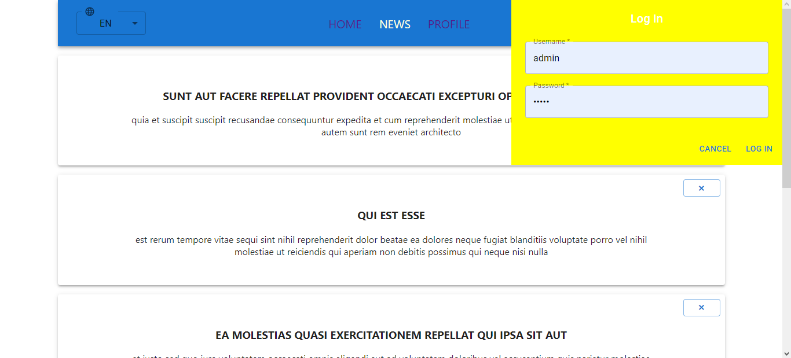

# 📰  https://it-tanka.github.io/job-project/ 
# TASK: 
### Implement a web application  that can display the following pages:

- / - main, arbitrary content.
-  /news – page with news. you can use mock data from https://jsonplaceholder.typicode.com/ or similar services. Implement the "upload more" button when clicking on which the posts are loaded, implement the deletion of the news.
-  /profile - page with arbitrary text, inaccessible without authorization.
On the website, in the header or in the basement, implement the link:

  On the main (/).
  News (/news).
  Profile (/profile) or the button to authorize if the user is not authorized.

### Implement multilingualism for the site menu 
(Ukrainian - uk, English - en) using react-i18next.

### The login form accepts "fake" data:
username: admin
password: 12345
If other data is entered, the following message is displayed:
Username or password entered incorrectly.
If the correct data is entered, redirect to the /profile page.
If you try to go to the /profile page without authorization, you should be redirected to the main page.

## APPLICATION REQUIREMENTS:
 -  Store user authorization information in localStorage. If the user has authorized and reloaded the page, the authorization should not "lose".
 - Everything you think is necessary, wake up in Redux.
 - Use material.ui for design
 - Use the following stack: react, react-router-dom, react-redux, @reduxjs/toolkit, typescript

 

# Getting Started with Create React App

This project was bootstrapped with [Create React App](https://github.com/facebook/create-react-app).

## Available Scripts

In the project directory, you can run:

### `npm start`

Runs the app in the development mode.\
Open [http://localhost:3000](http://localhost:3000) to view it in the browser.

The page will reload if you make edits.\
You will also see any lint errors in the console.

### `npm test`

Launches the test runner in the interactive watch mode.\
See the section about [running tests](https://facebook.github.io/create-react-app/docs/running-tests) for more information.

### `npm run build`

Builds the app for production to the `build` folder.\
It correctly bundles React in production mode and optimizes the build for the best performance.

The build is minified and the filenames include the hashes.\
Your app is ready to be deployed!

See the section about [deployment](https://facebook.github.io/create-react-app/docs/deployment) for more information.

### `npm run eject`

**Note: this is a one-way operation. Once you `eject`, you can’t go back!**

If you aren’t satisfied with the build tool and configuration choices, you can `eject` at any time. This command will remove the single build dependency from your project.

Instead, it will copy all the configuration files and the transitive dependencies (webpack, Babel, ESLint, etc) right into your project so you have full control over them. All of the commands except `eject` will still work, but they will point to the copied scripts so you can tweak them. At this point you’re on your own.

You don’t have to ever use `eject`. The curated feature set is suitable for small and middle deployments, and you shouldn’t feel obligated to use this feature. However we understand that this tool wouldn’t be useful if you couldn’t customize it when you are ready for it.

## Learn More

You can learn more in the [Create React App documentation](https://facebook.github.io/create-react-app/docs/getting-started).

To learn React, check out the [React documentation](https://reactjs.org/).
